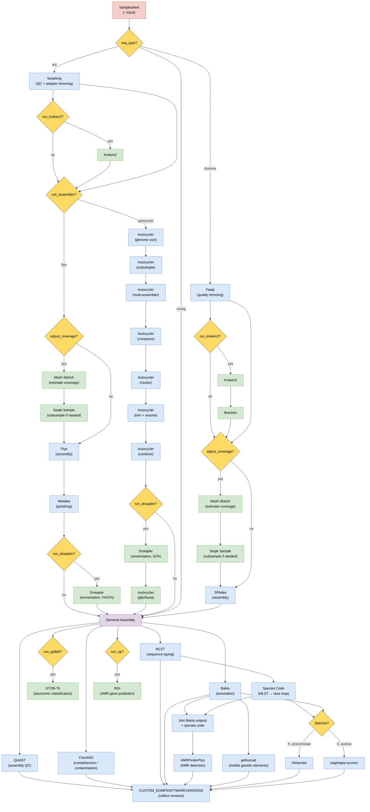

# MGAP Pipeline Workflow Diagram

## Overview

The **gene2dis/mgap** pipeline supports three input modes based on the `--seq_type` parameter: `illumina`, `ont`, or `contig`. Each mode feeds into a shared downstream analysis that includes assembly quality assessment, taxonomic classification, gene annotation, and antimicrobial resistance detection.

## Full Pipeline Diagram

## Subworkflow Details

### Illumina Subworkflow

| Step | Tool | Description |
|------|------|-------------|
| 1 | **Fastp** | Quality trimming of paired-end reads |
| 2 | **Kraken2 + Bracken** | Contamination detection *(optional)* |
| 3 | **Mash Sketch** | Coverage estimation *(optional, if `adjust_coverage`)* |
| 4 | **Seqtk Sample** | Read subsampling when coverage exceeds `max_coverage` |
| 5 | **SPAdes** | *De novo* genome assembly |

### ONT Subworkflow (Flye mode, default)

| Step | Tool | Description |
|------|------|-------------|
| 1 | **fastplong** | Quality filtering and adapter trimming of long reads |
| 2 | **Kraken2** | Contamination detection *(optional)* |
| 3 | **Mash Sketch** | Coverage estimation *(optional, if `adjust_coverage`)* |
| 4 | **Seqtk Sample** | Read subsampling when coverage exceeds `max_coverage` |
| 5 | **Flye** | *De novo* long-read assembly |
| 6 | **Medaka** | Assembly polishing |
| 7 | **Dnaapler** | Contig reorientation using FASTA input *(optional, `run_dnaapler`)* |

### ONT Subworkflow (Autocycler mode)

| Step | Tool | Description |
|------|------|-------------|
| 1 | **fastplong** | Quality filtering and adapter trimming of long reads |
| 2 | **Kraken2** | Contamination detection *(optional)* |
| 3 | **Autocycler genome_size** | Genome size estimation via Raven |
| 4 | **Autocycler subsample** | Subsample reads into independent subsets |
| 5 | **Autocycler assembly** | Fan-out assembly across multiple assemblers × subsamples |
| 6 | **Autocycler compress** | Compress assemblies into unitig graph |
| 7 | **Autocycler cluster** | Cluster unitigs into putative genomic sequences |
| 8 | **Autocycler trim + resolve** | Trim and resolve each QC-pass cluster |
| 9 | **Autocycler combine** | Combine resolved clusters into consensus assembly (FASTA + GFA) |
| 10 | **Dnaapler** | Reorient circular contigs using GFA input *(optional, `run_dnaapler`)* |
| 11 | **Autocycler gfa2fasta** | Convert reoriented GFA back to FASTA *(only when Dnaapler is enabled)* |

### Shared Downstream Analysis

| Step | Tool | Description |
|------|------|-------------|
| 1 | **QUAST** | Assembly quality metrics |
| 2 | **CheckM2** | Genome completeness and contamination assessment |
| 3 | **MLST** | Multi-locus sequence typing |
| 4 | **Bakta** | Genome annotation |
| 5 | **GTDB-Tk** | Taxonomic classification *(optional)* |
| 6 | **AMRFinderPlus** | Antimicrobial resistance gene detection (uses Bakta + MLST outputs) |
| 7 | **geNomad** | Mobile genetic element identification |
| 8 | **RGI** | Resistance gene prediction *(optional)* |

### Taxa-Specific Analysis

| Species | Tool | Description |
|---------|------|-------------|
| *Klebsiella pneumoniae* | **Kleborate** | Virulence and resistance scoring |
| *Staphylococcus aureus* | **staphopia-sccmec** | SCCmec cassette typing |
